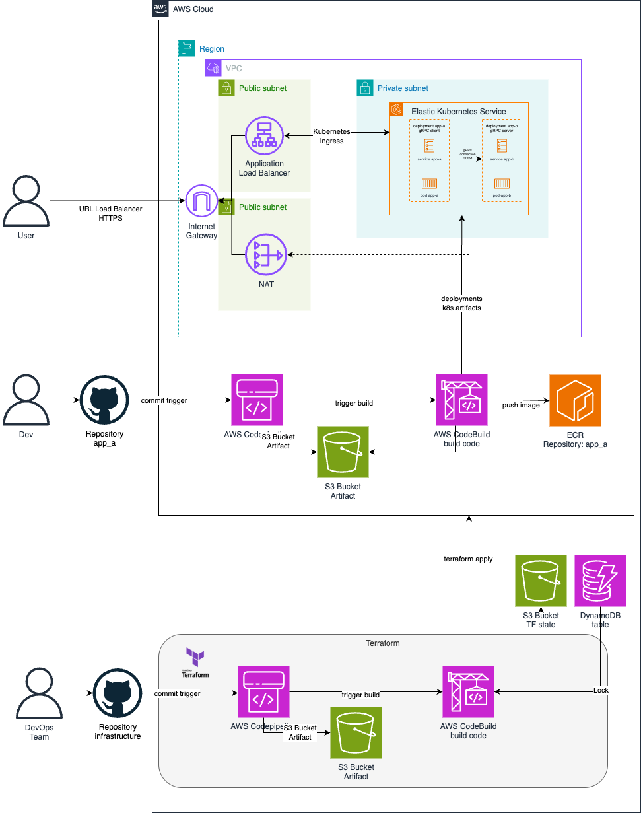

# Image Processor Deployment

Este proyecto implementa un servicio de procesamiento de imágenes utilizando gRPC y Kubernetes, desplegado en AWS utilizando Terraform y AWS CodeBuild.

## Diagrama de Arquitectura

El siguiente diagrama ilustra la arquitectura de la solución:



## Explicación del Networking

1. **VPC:** Se crea una VPC que contiene subredes públicas para alojar los recursos de EKS.
2. **Subredes Públicas:** Las subredes públicas permiten que los nodos de EKS tengan acceso a Internet para descargar imágenes de contenedores y actualizaciones.
3. **Internet Gateway:** Proporciona acceso a Internet para los recursos dentro de las subredes públicas.
4. **Route Tables:** Configuran las rutas para permitir el tráfico hacia y desde Internet.

## Guía de Despliegue

### Preparación del Entorno

- Asegúrate de tener configuradas las credenciales de AWS en tu máquina local.
- Crea el bucket de S3 y la tabla de DynamoDB para el estado de Terraform.

### Inicialización de Terraform

- Navega al directorio de Terraform y ejecuta `terraform init` para inicializar el backend y descargar los proveedores necesarios.

### Despliegue de Infraestructura

- Ejecuta `terraform plan -out=tfplan` and `terraform apply -auto-aprove tfplan` para crear la infraestructura en AWS. Revisa los cambios propuestos y confirma el despliegue.

### Configuración de CodeBuild

- Asegúrate de que los proyectos de CodeBuild estén configurados correctamente con los repositorios de GitHub y los roles de IAM necesarios.

### Despliegue de Aplicaciones

- Los proyectos de CodeBuild para `app_a` y `app_b` construirán y empujarán las imágenes Docker a ECR.
- CodeBuild aplicará los archivos de despliegue de Kubernetes para desplegar las aplicaciones en EKS.

### Verificación

- Usa `kubectl` para verificar que los pods y servicios estén corriendo correctamente en el clúster de EKS.
- Accede a `app_a` a través del LoadBalancer para verificar que la aplicación esté funcionando como se espera.

## Notas Adicionales

- **Permisos de IAM:** Asegúrate de que los roles de IAM tengan los permisos necesarios para interactuar con ECR, EKS, y S3.
- **Variables de Entorno:** Ajusta las variables de entorno y los parámetros de configuración según tus necesidades específicas.
- **GitHub Repositories:** Asegúrate de que los repositorios de GitHub estén configurados correctamente y que CodeBuild tenga acceso a ellos.

Este README proporciona una guía completa para desplegar y gestionar tu solución de procesamiento de imágenes en AWS.


# Proyecto Central

Este proyecto centraliza los subproyectos `app_a`, `app_b` e `infrastructure`.

## Inicialización

Después de clonar este repositorio, inicializa y actualiza los submódulos:

```bash
git submodule update --init --recursive
```
## Actualización de Submódulos
Para actualizar un submódulo a la última versión del repositorio remoto:

```bash
cd app_a
git pull origin main
```

Esta estructura te permitirá gestionar cada parte de tu proyecto de manera independiente mientras las mantienes organizadas bajo un proyecto central.

## AWS Load Balancer Controller
Se agrega modulo que permite la creacion de ALB controller en el cluster de EKS. Esto permite que el servicio Ingress pueda ser creado internamente desde el cluster de Kubernetes.

## Deployments en EKS
Los deployments usando el buildspec.yml permiten tener un mejor control de los stages, asi como tambien tener un control desde un solo punto de agente. Para esto, se agrega una nueva linea que permite autenticarse al cluster y poder hacer los deployments respectivos.

## Frontend
En Proceso

## Pruebas
Se puede probar la api usando Curl o Postman, cargando una imagen que tenga en su ambiente local.